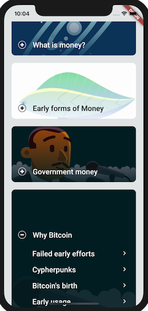

# The history of Money & Bitcoin

## Table of Contents
1. [Project description](#project-description)
2. [Contributor workflow (please read)](#contributor-workflow)
3. [Epoches and chapters](#preliminary-draft-of-epoches-and-chapters)
4. [Sources](#possible-sources)
5. [Help needed](#help-needed)

## Project description
The basic idea is to create an app that explains the origins of money, what money even is, why bitcoin is important and why it could (will) be the next step in monetary evolution and at the end give some tips on how to get started, i.e where to buy, where to store etc.
The app is not an attempt to outlay monetary history or the technicalities of Bitcoin as accurate and nuanced as possible. The goal is to give a ~1 hour introduction and get people familiar and interested in the topic. After going through the app they should have some basic understanding of Bitcoin so that they start exploring on their own.
This app seems great as a base and can be adapt it to our content/needs as necessary.  
HistoryOfEverything: https://github.com/2d-inc/HistoryOfEverything  
The app is open-source under a MIT License.

Similarly to that app, I would structure everything into a few different mega-chapters/epoches and then have 5-10 shorter chapter in these epoches, each with a reading time of up to 5 minutes.  
For a preliminary draft of the epoches and chapters please see below at.  
Each chapter should have a few "deep dive" resource links at the bottom.

The next step, after the app is launched, is to implement the following:
1. A quiz to test the users understanding. That quiz could credit the user points (used in step 2.)
2. A mechanism via which a user can easily get some BTC. It could either be a fixed amount per user or depend on the score from the quiz. There are multiple ideas on how such a mechanism could be implemented.
_______________________________________________

## Contributor workflow

The content is maintained using a "contributor workflow" where everyone contributes patch proposals using "pull requests".
This facilitates social contribution, easy testing and peer review.

To contribute a patch, the workflow is as follows:

  1. Create topic branch
  2. Commit changes
  4. Push changes to your branch
  5. Create pull request to the master branch

In general [commits should be regard one chapter/topic](https://en.wikipedia.org/wiki/Atomic_commit#Atomic_commit_convention) and diffs should be easy to read.

Please refer to the [Git manual](https://git-scm.com/doc) for more information about Git.

If a pull request is not to be considered for merging (yet), please prefix the title with [WIP] or use [Tasks Lists](https://help.github.com/articles/basic-writing-and-formatting-syntax/#task-lists) in the body of the pull request to indicate tasks are pending.

At this stage one should expect comments and review from other contributors.
You can add more commits to your pull request by committing them locally and pushing to your fork until you have satisfied all feedback.

_______________________________________________

_______________________________________________

## Preliminary draft of epoches and chapters

### 1. What is money?
### Pre-money
> Hunter-gatherers had no money. Bands were small and hunted, gathered and produced almost everything they required. Different members may have specialised in different tasks but they shared their goods and services through an economy of favours and obligations. Each band was economically independent, only a few rare items had to be bartered for with other bands. However, once cities emerged, opportunities for full-time specialisation arose. Specialisation, on the individual level but also on higher levels makes a lot of sense economically. If one village has great soil and becomes known for producing high-quality wine, it makes sense for that village to almost exclusivly specialise in that product and trade it for all other goods it needs. But how?
#### How does money naturally emerge?
> An economy of favours and obligations or a bartering-economy does not work with a large number of strangers.
Barter requires a coincidence of wants. Alice grows some pecans and wants some apples; Bob grows apples and want some pecans. They just happen to have their orchards near each other, and Alice just happens to trust Bob enough to wait between pecan harvest time and apple harvest time. __Assuming__ all these conditions are met, barter works pretty well. But if Alice was growing oranges, even if Bob wanted oranges as well as pecans, they'd be out of luck – oranges and apples don 't both grow well in the same climate. If Alice and Bob didn't trust each other, and couldn't find a third party to be a middleman or enforce a contract, they'd also be out of luck. Further complications could arise. Alice and Bob can't fully articulate a promise to sell pecans or apples in the future, because, among other possibilities, Alice could keep the best pecans to herself (and Bob the best apples), giving the other the dregs. Comparing the qualities as well as the quantities of two different kinds of goods is all the more difficult when the state of one of the goods is only a memory. Furthermore, neither can anticipate events such as a bad harvest. These complications greatly add to the problem of Alice and Bob deciding whether separated reciprocal altruism has truly been reciprocal. These kinds of complications increase the greater the time interval and uncertainty between the original transaction and the reciprocation. A related problem is that, as engineers would say, barter "doesn't scale". Barter works well at small volumes but becomes increasingly costly at large volumes, until it becomes too costly to be worth the effort. If there are __n__ goods and services to be traded, a barter market requires __n^2__ prices. Five products would require twenty-five prices, which is not too bad, but 500 products would require 250,000 prices, which is far beyond what is practical for one person to keep track of. Some societies tried to solve this with a central bartering system that collected products from specialists and distributed it to those who needed them. The most famous such experiment was conducted in the Soviet Union and failed miserably. There were other such experiments with more or less success, but most societies found a better solution to connect a large number of specialist. Money.     With money, there are only __n__ prices – 500 products, 500 prices. Barter requires, in other words, coincidences of supply or skills, preferences, time, and low transaction costs. Its cost increases far faster than the growth in the number of goods traded. Barter certainly works much better than no trade at all, and has been widely practiced. But it is quite limited compared to trade with money. To answer the question how money emerges we will take a little detour. Let's start here: "The price for which you can buy a good at a given time is different to the price you can sell the same good again at a given point in time." Even the most common goods cannot be sold at the same price at a given point in time. If you have time to wait, then surely you could sell it at the same price but given a time constraint you will probably have to sell for less than the price you paid. Depending on how high that difference is we say a good is more or less saleable.  
The saleability of a given good depends on a multitude of factors, including spatial limitations (e.g. how well the good is distributed, how easily it can be transported...) and time limits (e.g. the permanence of the need for such a good, the durability of the good...). Thus it follows that some goods can be sold again with ease and certainty, at any time, at fair prices, while the saleability of other goods is more confined to spatial and temporal limits, thereby increasing the discount you have to give in order to sell the good at a given time. Over time, people will realise that some of the goods they got in their barter trades are easy to exchange again and would therefore accept these goods more willingly and also try to barter their less saleable goods in exchange for more saleable goods, thereby increasing the goods saleability even further. Only goods that have low spatial and time limits (i.e. easy to transport, durable, scarcely distributed) qualify to become such a good. It is in everyones economic interest to exchange their less saleable goods for more saleable ones. As a result, the goods that  are most saleable, relative to both space and time and, are the ones everyone readily accepts. At that point that good can be called money.  
- Sale-ability
#### A shared myth:
> Money was created many times in many places. It's development required no technological breakthroughs, it was a purely mental revolution. Money can be anything, as long as it fullfills the described criteria i.e is highly saleable. Money has value because we believe it has value and because everyone does, it has. Trust is the raw material from which all money is minted.
#### Functions of money:
> Money has three fundamental functions. It enables people to compare the value of different goods, i.e a unit of account, it makes exchanges easier, i.e. a medium of exchange, and it stores wealth, i.e. a store of value.
Let's now explore some early forms of money.

_______________________________________________

### 2. Proto money
> The most familiar form of money to most are coins. Yet money existed long before the invention of coinage and different cultures have flourished using different kinds of money, all of them being goods which were highly saleable compared to other goods.
#### Wampum beads
> Wampum is a traditional shell bead of the Eastern Woodlands tribes of American Indians. Before contact with Europeans, strings of wampum were used for storytelling, ceremonial gifts, and recording important treaties and historical events, such as the Two Row Wampum Treaty or The Hiawatha Belt. Wampum was also used by the northeastern Indian tribes as a means of exchange, strung together in lengths for convenience. The process to make wampum was labor-intensive with stone tools. Only coastal tribes had sufficient access to the basic shells to make wampum. When European Colonists came to the Americas, they adopted wampum as money to trade with the native peoples of New England and New York. Eventually, the Colonists applied their technologies to more efficiently produce wampum, which caused inflation and ultimately destroyed wampum as a currency.
#### Rai stones
> The Micronesian island of Yap is known for its stone money, known as Rai. Large doughnut-shaped, carved disks, up to 4 m in diameter. The smallest can be as little as 3.5 centimetres in diameter. The perceived value of a specific stone is based on not only its size and craftsmanship, but also its history. If many people—or no one at all—died when the specific stone was transported, or a famous sailor brought it in, the value of the rai stone increases by reason of its anecdotal heft. The monetary system of Yap relies on an oral history of ownership. Because these stones are too large to move, buying an item with one simply involves agreeing that the ownership has changed. As long as the transaction is recorded in the oral history, it will now be owned by the person to whom it is passed and no physical movement of the stone is required. In one instance, a large rai was transported by canoe and was accidentally dropped and sank to the sea floor. Although it was never seen again, everyone agreed that the rai must still be there, so it continued to be transacted as genuine currency. What is important is that ownership of the rai is clear to everyone, not that the rai is physically transferred or even physically accessible to either party in the transfer. As we will later see, this system is very similar to how bitcoin works.

_______________________________________________

### 3. Commodity (backed) money
#### Asian cutlery ~1100 BC
> Sometime around 1100 B.C., the Chinese moved from using actual tools and weapons as a medium of exchange to using miniature replicas of the same tools cast in bronze. Nobody wants to reach into their pocket and impale their hand on a sharp arrow so, over time, these tiny daggers, spades and hoes were abandoned for the less prickly shape of a circle, which became some of the first coins. Although China was the first country to use recognizable coins, the first minted coins were created not too far away in Lydia (now western Turkey).
#### Coins ~ 600 BC
> In 600 B.C., Lydia's King Alyattes minted the first official currency. The coins were made from electrum, a mixture of silver and gold that occurs naturally, and stamped with pictures that acted as denominations. Unfortunately, minting the first coins and developing a strong trading economy couldn't protect Lydia from the swords of the Persian army and when Lydia was conquered by the Persians in 546 BCE, coins were introduced to Persia. In China, gold coins were first standardized during the Qin dynasty (221–207 BCE).
https://en.wikipedia.org/wiki/Coin
#### Egyptian grain banks ~ 330 BC
> Ancient Egyptian governments centralised harvests in state warehouses. Grain harvesters would deposit their grain into the central warehouses for security and convenience. The depositors could then withdraw a particular lot of grain when they wanted to make a purchase. Sometimes the deposits into these Egyptian grain banks were voluntary and other times it was required by the king. Written orders, i.e. a cheque, for grain withdrawal could be used to pay tax collectors, priests and merchants. Eventually, the metallic monetary system displaced the use of grain as a medium of exchange by the Roman era.
#### Paper Money ~ 600 - 1200 AD
https://en.wikipedia.org/wiki/Banknote
> While the invention of coins solved many problems for money, there were still disadvantages. For one, coins were moulded from precious metals including gold. Circulation and supply growth was limited by the availability of those precious metals. Furthermore, they took up space and were heavy, which made storing them and carrying them inconvenient. In 600 AD the Chinese invented the first form of paper. Rather than carrying coins everywhere, people could leave their valuables at the bank, and the bank would provide a signed note that verified the value of the item(s) a person had in the bank; i.e., the first banknote. This system was based on trust that the note could be exchanged for actual valuables. Instead of exchanging for the tangible valuables at any time, people could continue to exchange the notes. With Mongolia’s invasion of China, the Mongol Empire picked up on the practice of paper currency as well.
#### Paper money in Europe ~1200 AD
> In the 13th century, while most of Europe was using metal coins, especially the Florin for international trade, Marco Polo brought paper money to Europe. By the 17th century, Europe had caught on to the trend and goldsmiths adopted the practice of using notes as a security, backed by the goldsmiths’ gold itself. Eventually, the banks started using bank notes for depositors and borrowers to carry around instead of coins. These notes could be taken to the bank at any time and exchanged for their face values in silver or gold coins. This paper money could be used to buy goods and operated much like currency today, but it was issued by banks and private institutions, not the government, which is now responsible for issuing currency in most countries. Because people were using and holding the paper note rather than exchanging everything for the backed valuables, European banks started to issue more notes than could be all backed up at once, betting on the hypothesis that every individual holding their notes would not all come knocking on their door the next day asking for gold. This practice is called fractional reserve banking and is at the centre of modern finance.

#### Gold standard
> Gold has been prevalent throughout the evolution of money and has been one of the most widely accepted forms of money for centuries. The gold standard is a monetary system in which paper money is freely convertible into a fixed amount of gold. In other words, in such a monetary system, gold backs the value of money. In 1821, the United Kingdom became the first country to adopt the gold standard. Prior to this time, silver had been the main world monetary metal, while gold was used intermittently for coinage in one or another country, but never as the standard, to which all other forms of currency were coordinated or adjusted.  As all trade imbalances between nations were settled with gold, governments had strong incentive to stockpile gold for more difficult times. Those stockpiles still exist today. By the 1870s, Germany took on a monometallic gold standard and as of 1900 the US and several other countries followed suit. From 1871 to 1914, the gold standard was at its pinnacle. Governments worked very well together to make the system work, but this all changed forever with the outbreak of World War 1 in 1914. When governments realised they needed more money to finance the war than they could raise, they resorted to printing more money. Unfortunately, printing money created hyperinflation.
After the war, countries realised the value of tying their currency to a guaranteed value in gold most countries returned to a modified gold standard. The gold-exchange standard collapsed again during the Great Depression of the 1930s, and by 1937 not a single country remained on the full gold standard. The gold standard was largely abandoned in an effort to combat the lingering effects of the Great Depression. The United States in particular decided to make the move away from gold because the country was facing both mounting unemployment and spiraling deflation. In response to a weak economy, the US Federal Reserve and several other governments kept raising interest rates in an attempt to make dollars more valuable and dissuade people from further depleting the US gold reserves. These higher rates worsened the Depression by making the cost of doing business more expensive. Many companies went bankrupt, creating record levels of unemployment.
In order to rectify the damage done by surging interest rates, in 1933, President Franklin D. Roosevelt cut the US dollar’s ties with gold, allowing the government to pump money into the economy while lowering interest rates.
#### Bretton Woods Agreement
> Benton Woods was developed at the United Nations Monetary and Financial Conference held in Bretton Woods in 1944. Under the agreement, currencies were pegged to the price of gold, and the US dollar was seen as a reserve currency linked to the price of gold. This meant that all national currencies were valued in relation to the US dollar, since it had become a dominant reserve currency.
In turn, the dollar, was convertible to gold at the fixed rate of US$35 per ounce. The global financial system continued to operate upon a gold standard, in a far more indirect manner. By 1971, Nixon called for a temporary suspension of the dollar’s convertibility. Countries were then free to choose any exchange agreement. In 1973, foreign governments let currencies float, which put an end to the Bretton Woods system and any trace of the gold standard was abolished.

_______________________________________________

### 5. Fiat Money
#### Keynsian & Moneterian
- What is their main claim?
#### Austrian
- What is their main claim?
#### Sound vs Unsound money
_______________________________________________

### 6. History of Bitcoin
The invention of Bitcoin is built on decades of work and by tracing this history, we can understand the motivations behind the movement that spawned bitcoin and share its vision for the future.

Before the 1970s, cryptography was primarily practiced in secret by military or spy agencies. But, that changed when two publications brought it into the open: the US government publication of the [Data](http://csrc.nist.gov/publications/fips/fips46-3/fips46-3.pdf) Encryption Standard and the first publicly available work on public-key cryptography, “[New Directions in Cryptography](https://www-ee.stanford.edu/~hellman/publications/24.pdf)” by Dr Whitfield Diffie and Dr Martin Hellman.

In the 1980s, Dr David Chaum wrote extensively on topics such as anonymous digital cash and pseudonymous reputation systems, which he described in his [paper](http://www.chaum.com/publications/Security_Wthout_Identification.html) “Security without Identification: Transaction Systems to Make Big Brother Obsolete”. Over the next several years, these ideas coalesced into a movement. It gave birth to the Cypherpunks.

#### Cypherpunks

- (https://www.coindesk.com/the-rise-of-the-cypherpunks)
- Who were they? What do they stand for?
- Manifesto: https://github.com/NakamotoInstitute/nakamotoinstitute.org/blob/master/sni/static/docs/cypherpunk-manifesto.txt

In late 1992, Eric Hughes, Timothy C May, and John Gilmore founded a small group that met monthly at Gilmore’s company Cygnus Solutions in the San Francisco Bay Area. The group was humorously termed “cypherpunks” as a derivation of “cipher” and “cyberpunk.”

The Cypherpunks mailing list was formed at about the same time, and just a few months later, Eric Hughes published “A Cypherpunk’s Manifesto“. He wrote:

“Privacy is necessary for an open society in the electronic age. Privacy is not secrecy. A private matter is something one doesn’t want the whole world to know, but a secret matter is something one doesn’t want anybody to know. Privacy is the power to selectively reveal oneself to the world.” Read [here](https://github.com/NakamotoInstitute/nakamotoinstitute.org/blob/master/sni/static/docs/cypherpunk-manifesto.txt) the full manifesto.

Some notable Cypherpunks and their achievements:

- Jacob Appelbaum: Tor developer
- Julian Assange: Founder of WikiLeaks
- Dr Adam Back: Inventor of Hashcash, co-founder of Blockstream
- Bram Cohen: Creator of BitTorrent
- Hal Finney: Main author of PGP 2.0, creator of Reusable Proof of Work
- Tim Hudson: Co-author of SSLeay, the precursor to OpenSSL
- Paul Kocher: Co-author of SSL 3.0
- Moxie Marlinspike: Founder of Open Whisper Systems (developer of Signal)
- Steven Schear: Creator of the concept of the “warrant canary”
- Bruce Schneier: Well-known security author
- Zooko Wilcox-O’Hearn: DigiCash developer, Founder of Zcash
- Philip Zimmermann: Creator of PGP 1.0

#### Failed early efforts:
- DigiCash, e-gold
- Why did they fail? Centralisation
- Hal finney, Nick szabo, adam back, w. dai etc.

In 1997, Dr Adam Back created [Hashcash](http://www.hashcash.org/papers/announce.txt), which was designed as an anti-spam mechanism that would essentially add a (time and computational) cost to sending email, thus making spam uneconomical.

He envisioned that Hashcash would be easier for people to use than Chaum’s digicash since there was no need for the creation of an account. Hashcash even had some protection against “double spending.”

Later in 1998, Wei Dai published a [proposal](http://www.weidai.com/bmoney.txt) for “b-money”, a practical way to enforce contractual agreements between anonymous actors. He described two interesting concepts. First, a protocol in which every participant maintains a separate database of how much money belongs to user. Secondly, a variant of the first system where the accounts of who has how much money are kept by a subset of the participants who are incentivized to remain honest by putting their money on the line.

Cypherpunks had already been building on each other’s work for decades, experimenting and laying the frameworks that Bitcoin needed in the 1990s, but a pivotal point was the creation of cypherpunk money in the 2000s.

In 2004, Hal Finney created [reusable proof of work](https://cryptome.org/rpow.htm) (RPOW), which built on Back’s Hashcash. RPOWs were unique cryptographic tokens that could only be used once, much like unspent transaction outputs in bitcoin. However, validation and protection against double spending was still performed by a central server.

Nick Szabo published a [proposal](http://unenumerated.blogspot.com/2005/12/bit-gold.html) for “bit gold” in 2005 – a digital collectible that built upon Finney’s RPOW proposal. However, Szabo did not propose a mechanism for limiting the total units of bit gold, but rather envisioned that units would be valued differently based upon the amount of computational work performed to create them.

#### Birth of bitcoin and bitcoin white paper
- Who was Nakamoto?
- What happened to his coins?
- What happened to him?
- How did he release his invention?
- Did he premine?

Finally, in 2008, Satoshi Nakamoto, a pseudonym for a still-unidentified individual or individuals, published the bitcoin whitepaper, citing both hashcash and b-money.

On 31 October 2008, a link to a paper authored by Satoshi Nakamoto titled Bitcoin: A Peer-to-Peer Electronic Cash System was posted to a cryptography mailing list.[12] This paper detailed methods of using a peer-to-peer network to generate what was described as "a system for electronic transactions without relying on trust". On 3 January 2009, the bitcoin network came into existence with Satoshi Nakamoto mining the genesis block of bitcoin (block number 0), which had a reward of 50 bitcoins. Embedded in the coinbase of this block was the text: "The Times 03/Jan/2009 Chancellor on brink of second bailout for banks"

The text refers to a headline in The Times published on 3 January 2009.[18] This note has been interpreted as both a timestamp of the genesis date and a derisive comment on the instability caused by fractional-reserve banking.

The value of the first bitcoin transactions were negotiated by individuals on the bitcoin forum with one notable transaction of 10,000 BTC used to indirectly purchase two pizzas delivered by Papa John's.

Satoshi dedicated a section of the [bitcoin whitepaper](http://bitcoin.org/bitcoin.pdf) to privacy, which reads:

“The traditional banking model achieves a level of privacy by limiting access to information to the parties involved and the trusted third party. The necessity to announce all transactions publicly precludes this method, but privacy can still be maintained by breaking the flow of information in another place: by keeping public keys anonymous. The public can see that someone is sending an amount to someone else, but without information linking the transaction to anyone. This is similar to the level of information released by stock exchanges, where the time and size of individual trades, the ‘tape’, is made public, but without telling who the parties were.” Read full Bitcoin whitepaper [here](http://bitcoin.org/bitcoin.pdf).

Satoshi Nakamoto triggered an avalanche of progress with a working system that people could use, extend and fork.

Bitcoin strengthened the entire cypherpunk movement by enabling organizations such as WikiLeaks to continue operating via bitcoin donations, even after the traditional financial system had cut them off.

#### Early usage of bitcoin
- Is it only used for illegal things?
- Do only crooks use bitcoin?
- Is Bitcoin anonymous?

#### famous exchange hacks
- Third parties are a secuity hole.
- How does bitcoin enable you to not trust any third party?
#### Waves of adoption and price bubbles

#### Scaling bitcoin debate, UASF
- Vertical scaling (bigger blocks) vs layered scaling
- UASF: which proves that miners have not much to say in Bitcoin --> might be a bit too deep for this audience??
_______________________________________________

### 7. Why bitcoin
<!-- https://www.youtube.com/watch?v=CyieujRFk3g&feature=youtu.be&t=13840 -->
#### Forks & Altcoins
- illusion of next bitcoin
- why they are doomed to go to zero
#### Game theory , Schelling point, Lindy effect, network effect etc...
_______________________________________________

### 8. How Bitcoin works
- Listen to chapter 9 "The bitcoin standard"
#### Keys & Addresses
- What is a private key? A long random number
- What is a public key?
> Bitcoin makes use of cryptography to create a key pair that controls access to your bitcoin. The key pair consists of a private key, which a long random number, and mathematically derived from it a public key. The public key is used to receive coins, and the private key is used to sign transactions to spend the coins.
- Why is from private to public easy, but vice versa hard?
> The mathematical relationship between the public and the private key has the following properties: A) It is infeasible to calculate the private key from the public key,  B)  The private key can be used to generate digital signatures on messages. These signature can then be validated with the help of the public key without revealing the private key.
- What is an address?
> When sending Bitcoin the recipient is (in most cases) a Bitcoin address. A Bitcoin address is derived from a public key and allows. Using an address as the recipient compared to sending directly to a public key (which isn't possible in Bitcoin) has certain security and privacy advantages.
- Why do we need addresses? Other cryptos don't have them.
> This could be too deep. "Addresses provide greater security because even if the ECDSA breaks the double hash will still protect your money."
- How many private keys are there? Isn't it likely that someone else will generate the same private key?
> A private key is 64-characters long, each of which can be one of 16 characters, called hexadecimal (0-9 + A-G). That means there are 16^64 or 2^256 possible private keys. That is 115,79 quattuorvigintillion or 115792089237316195423570985008687907853269984665640564039457584007913129639936.
As a reference there are about 2^229 atoms in the milky way. How likely is it that you can tell me which of these atoms I'm currently thinking about?
https://www.youtube.com/watch?v=S9JGmA5_unY
- What does it mean to own bitcoin?
> Owing bitcoin means nothing more and nothing less than being in possession of the private key(s) that allow you to unlock/transfer these bitcoins. Just a random number, but undoubtedly a very important one.

#### Wallets
- What is a wallet? Why is "wallet" a mis-namer? What does a wallet do?
> A common misconception about bitcoin is that bitcoin wallets "contain" bitcoin. In fact, a wallet only contains digital keys (private keys). The “coins” are recorded in the blockchain. Users control the coins by signing transactions with the private keys in their wallets. In that sense, a bitcoin wallet actually is a keychain.
- How did wallets evolve?
> At first a bitcoin wallet would create a set of key-pairs which were unrelated to each other which means each of these keys had to be backed up individually, later with Bitcoin-Improvement-Proposal-32, short BIP-32, hierarchical deterministic wallets were introduced. This type of wallet stores one master private key from which all child keys are mathematically derived. This greatly reduced the complexity as it allowed users to only back up one private key. Another great improvement was the introduction of BIP-39 which allows us to represent the master private key as a mnemonic sentence, consisting of 12 to 24 words. From then on you did not have to back up a 64 character private-key for which one single wrong character means loss of coins but instead a sentence of easily recognisable words.
- What types of wallets are there?
> There are a few different kinds of wallets, depending on different use cases. Generally there is a spectrum from hot to cold wallets and a classification between custodial and non-custodial wallets.  
A *custodial* wallet is a wallet where you do not hold the master private key (seed) yourself, but a third party. Examples of that is leaving your bitcoin on an exchange. If the exchange gets hacked, your coins are likely lost. In the true bitcoin-spirit we would advise against using such a wallet as it comes with tremendous risks, which are not worth the convenience.
A *non-custodial* wallet is a wallet that contains the master private key (seed), thereby having full and sole control over the coins. Examples of such wallets are the following:  
*Paper wallets:* a paper wallet is a piece of paper with a privat key and an address printed on it. Paper wallets are generally not recommended anymore as it is easy to get it wrong and loose your coins.
*Software wallets:* An application that contains your master private key and let's you send and receive coins easily. A software wallet is recommended for low amounts, due to the insecure nature of a smartphone.  Similarly you would not put all your fiat money in to your purse/wallet that you carry around day in day out.
*Hardware wallets:* A dedicated device with the sole purpose of keeping your seed secure while still allowing you to interact with your coins with ease. This type of wallet is generally recommended to safekeep larger amounts of coins.

#### Transactions
- How is a tx constructed?
- What are inputs and outputs?
- What are fees? Can I pay no fee?
> A transactions is a piece of data that describes the transfer of value between participants in the bitcoin system. Each transaction is a public entry in bitcoin’s global blockchain, visible and verifiable to everyone. At the system level, there are no coins, no senders, no recipients, no balances, no accounts, and no addresses. All those things are constructed at a higher level for the benefit of the user, to make things easier to understand. The fundamental building blocks of a bitcoin transaction are unspent transaction outputs. Transaction outputs are indivisible chunks of bitcoin currency, similarly to how you cannot cut up a paper bank note. However you can spend your note and get some change back. The same is the case in bitcoin. If you want to spend a fraction of one of one of your unspent transaction outputs (UTXO) your wallet creates a transaction with one input (the unspent transaction output) and two outputs, one to the recipient and one back to you. Receiving bitcoins means that your wallet has detected a new UTXO that is spendable with the keys in your wallet. Thus, your bitcoin “balance” is the sum of all UTXO that your wallet can spend and which may be scattered among hundreds of transactions. The concept of a balance is created by the wallet software. You have probably heard that a bitcoin transaction costs fees. Such a fee isn't explicitly defined in the transaction but instead is the difference between the sum of the inputs and the sum of outputs. The higher that difference, the higher the fee, the higher the incentive for miners (which we will talk about soon), to verify and include your transaction in the blockchain. That means, the less urgent your transaction is, the lower of a fee you can choose.
#### Bitcoin Network
- What is a node?
- What types of nodes are there?
- What are nodes doing?
> Bitcoin is structured as a peer-to-peer network architecture on top of the internet. The term peer-to-peer, or P2P, means that the computers that participate in the net‐ work are peers to each other, that they are all equal, that there are no “special” nodes, and that all nodes share the burden of providing network services. There is no server, no centralised service, and no hierarchy within the network. Although nodes in the bitcoin P2P network are equal, they may take on different roles depending on the functionality they are supporting. A bitcoin node is a collection of functions: routing, the blockchain database, mining, and wallet services. Some nodes, called full nodes, also maintain a complete and up-to-date copy of the blockchain. Full nodes can autonomously and authoritatively verify any transaction without external reference. Some nodes maintain only a subset of the blockchain and verify transactions using a method called simplified payment verification, or SPV. Running a full node gives you the pure bitcoin experience: independent verification of all transactions without the need to rely on, or trust, any other systems.

> Bitcoin full nodes track all available and spendable outputs, known as unspent transaction outputs (UTXOs) and verify the validity of each transaction. Before forwarding transactions to its neighbours, every bitcoin node that receives a transaction will first verify the transaction. This ensures that only valid transactions are propagated across the network, while invalid transactions are discarded at the first node that encounters them. This independent validation of each new block by every node on the network ensures that the miners cannot cheat.  The collection of all UTXO is known as the UTXO-set and currently numbers in the millions of UTXO. The UTXO set grows as new UTXO is created and shrinks when UTXO is consumed. Every transaction represents a change (state transition) in the UTXO set as each transaction consumes UTXOs as inputs and creates new UTXOs as outputs. The only kind of transaction that is creating completely new bitcoins is called a coinbase transaction which we will cover in the chapter on mining.

#### Blockchain
> The blockchain data-structure is an ordered, back-linked list of blocks, which consist of transactions. Blocks are linked “back,” each referring to the previous block in the chain. The first block in the blockchain is called the genesis block and was created in 2009. It is the common ancestor of all the blocks in the blockchain, meaning that if you start at any block and follow the chain backward in time, you will eventually arrive at the genesis block. The genesis block contains a hidden message within it. The coinbase transaction input contains the text “The Times 03/Jan/2009 Chancellor on brink of second bail‐ out for banks.” This message was intended to offer proof of the earliest date this block was created, by referencing the headline of the British newspaper €e Times. It also serves as a tongue-in-cheek reminder of the importance of an independent monetary system, with bitcoin’s launch occurring at the same time as an unprecedented world‐ wide monetary crisis. The message was embedded in the first block by Satoshi Nakamoto, bitcoin’s creator. Every 10 minutes on average a new block is added to the blockchain, by a process called mining, which we will explore in the next chapter. The more child blocks are attached to a block, the "deeper" a block is in the blockchain. As an example, a block that was mined 1 hour ago likely has 6 confirmations and therefore has a depth of 6 currently. The greater the depth of a block and of the transactions in that block, the more unlikely it becomes that the block can be modified. More on that in the chapter on "Attacks on Bitcoin"
- Why do I need to know the complete blockchain?
- Isn't a blockchain slow and inefficient database?
- What makes the bitcoin blockchain so special?
#### Mining & Consensus
- Do we need  to explain what a hash function is?
- What are miners doing?
- How are miners getting paid? and why?
- What are coinbase transactions?
- Which functions does mining fullfill?
- How many Bitcoins are there and how many will there be?
> Mining secures the bitcoin system and enables the emergence of network-wide consensus (agreement on state) without a central authority, i.e. no central server controls a database to which each transaction is added. Instead, each miner takes new transactions and builds a block. Each new block contains a reference to the last valid block, thereby building a chain of blocks. He then tries to solve a cryptographic puzzle, while competing against all other miner. The miner that first finds a valid solution has won and publishes his block. Then all the other miners and full nodes will confirm that the block is indeed valid. Valid means that each transaction in the block and the solution to the block puzzle are correct. If that is the case, each miner adds the block to their local copy of the blockchain and starts the next mining round. If there is a mistake in the block, each miner discards the block and starts mining again.  Finding a solution to a block puzzle is extremely difficult and is adjusted every two weeks to keep the average time between new blocks at 10 minutes. If new miners joined the network, i.e. the total computing power increased, the block puzzle will become harder. If instead a lot of miners are turned of, the puzzle will become easier again. In order to incentivise miners to do that work, each miner includes a special transaction in the block they are trying to find the solution for, i.e the coinbase transaction which credits the miner newly created bitcoin. If the miner wins and is the first one to publish a new block with a valid solution, that block with the included coinbase transaction is added to the blockchain, thereby crediting the miner newly minted bitcoin. Moreover, a miner also gets credited with the sum of all fees of the transactions in a block. This obviously incentivises miners, to prefer transactions with higher fees, thereby adding them to the blockchain faster.  The reward of newly minted coins and transaction fees is an incentive scheme that aligns the actions of miners with the security of the network, while simultaneously implementing the monetary supply mechanism. That so called block reward halves every 4 years. It started at 50 BTC per block, currently is at 12.5 BTC per block and will half again to 6.15 BTC per block in mid-2020 and so on. Based on this formula, bitcoin mining rewards decrease exponentially until approximately the year 2140, when all bitcoin (20.99999998 million) will have been issued. After 2140, no new bitcoin will be issued. Thereafter, blocks will contain no new bitcoin, and miners will be rewarded solely through the transaction fees. This predetermined issuance rate results in a reducing inflation rate over time. After the next halvening (mid-2020) the inflation rate will be below 2% and thereby lower than that of most national currencies. The finite and diminishing issuance creates a fixed monetary supply that resists inflation. Unlike a fiat currency, which can be printed in infinite numbers by a central bank, bitcoin can never be inflated by printing.
Summed up, mining has the following functions:
A) bitcoin issuance via block reward
B) decentralised voting on which miner is allowed to add a new block via the solution to the block puzzle

> Bitcoin’s mining consensus mechanism depends on having a majority of the miners acting honestly out of self-interest and is, at least theoretically, vulnerable to attack by miners that attempt to use their computing power to dishonest or destructive ends.  If a miner or group of miners can achieve a significant share of the mining power, they can attack the consensus mechanism so as to disrupt the security and availability of the bitcoin network.
Such attacks can only affect future consensus, or at best, the most recent past (tens of blocks). Bitcoin’s blockchain becomes more and more immutable as time passes. While in theory, a fork can be achieved at any depth, in practice, the computing power needed to force a very deep fork is immense, making
old blocks practically immutable. Consensus attacks also do not affect the security of the private keys and signing algorithm (ECDSA). A consensus attack cannot steal bit‐ coin, spend bitcoin without signatures, redirect bitcoin, or otherwise change past transactions or ownership records. Consensus attacks can only affect the most recent blocks and cause denial-of-service disruptions on the creation of future blocks. One attack scenario against the consensus mechanism is called the “51% attack.” In this scenario a group of miners, controlling a majority (51%) of the total network’s hashing power, collude to attack bitcoin. With the ability to mine the majority of the blocks, the attacking miners can cause deliberate “forks” in the blockchain and double-spend transactions or execute denial-of-service attacks against specific trans‐ actions or addresses.

- What if nodes run different, incompatible software?
- Difference between hard- and softfork?
> The software that runs on most miners and full nodes is called Bitcoin Core. It's job is to checks each new block and the transactions in that block for validity. When that software needs to be updated two things could happen, depending on the types of changes. A) Nodes that did not update  still see blocks from miners that did update as valid, i.e. the update is forward-compatible. That is called a soft-fork. B) Nodes that did not update see blocks from miners that did update as invalid, i.e. the update is forward-incompatible. That is called a hard-fork. Put differently, a soft-fork reduces the set of valid operations (e.g. 0.5 MB blocks would still be valid to nodes that did not follow the soft fork)  whereas hard-forks introduce rules that would have been invalid before (e.g. 2 MB blocks are invalid right now so only nodes that update will see them as valid). As hard-forks carry the risk of splitting the network, it is only done with utmost care and only if a large percentage of the network can agree on supporting the changes beforehand.

- How are nodes agreeing on which chain(tip) is the right one?
> I think this is a bit too deep for the intended audience.
#### Attacks on Bitcoin Why Bitcoin is immutable
-
#### How to kill bitcoin
- What are possible threats for bitcoin?
- ( We can omit this section. saifedean has some material here )
_______________________________________________

### 9. Lightning
- What is Lightning?
- Why is it needed?
- Lightning channel and Lightning network in simple words without going into technical ( comparing lighting channel to some real life analogy. One way to explain is like two people puts some money on a table and can exchange as many time as they want without declaring to whole world. And extend it to more than two people participating in exchange )
#### Multisig
- What is multisig?
- Is it only used for lightning?
#### Timelocks
- What are timelocks?
- What types of timelocks exist?
- Is it only used for lightning?
#### HTLC
#### Payment Channels
- How to fund a channel?
- How to manage liquidity? What needs to be considered?
#### Lightning Network
- How can I pay a node that I don't have a channel with?
- Upcoming lighting features

### 10. Getting started
- List of wallets
- List of exchanges
- List of good further resources
- Mechanism to request some Satoshis

_______________________________________________

### Emergence of banking (not sure if included)
> While prostitution has long been regarded as the first profession and lawyers as close second, the banking profession is clearly the third oldest known to humankind. The invention of banking preceded that of coinage by several thousand years. Banking appears to have originated in Ancient Mesopotamia. Receipts in the form of clay tablets were used to record transfers between parties. Among some of the earliest recorded laws (Code of Hammurabi), pertain to the regulation of the banking industry in Mesopotamia. The development of banking in Mesopotamia is quite interesting. It illustrates that all the modern practices such as deposits, interest, loans and letters of credit existed from the time of the first great civilisations on earth. The emergence of the banking system was an integral part in the development of civilisation. As the monetary system gravitated toward a metallic form, the banking industry was needed for safekeeping as well as money changing.
#### Greek banking
> As the standardisation of coinage began to take hold among the Greek city-states, the variety in weight standards created a demand for foreign exchange transactions thus creating the profession of moneychangers. The tables utilised by the money changing trade were trapezium in shape and usually marked with a series of lines and squares used in calculations. This is the origin of the word “trapezitai” – the name used for Greek bankers. The word “bank” owes its heritage to the Italian word “banca” meaning bench or counter. This need to store wealth greatly increased the ability to borrow thus allowing the foundations of modern day credit to emerge. The development of the banking industry was a milestone in the evolution of civilization. Both the banking industry and the monetary system fostered interaction among the peoples of the world thus allowing international trade.

#### Roman banking
> The Romans institutionalized banking building upon the Delos model but also attempted to standardize the monetary system. However, in the aftermath of the fall of the Roman Empire, banking disappeared in the chaos of barbarian invasions. The collapse of Rome ushered in the Dark Ages. The absence of banking led to the brake down of trade and organization. Civilization had been dealt a severe deathblow in Europe. It would take several centuries to pass before general prosperity and a rise in culture and living standards would reemerge once again out of necessity.

#### Italian banking
>

_______________________________________________
## Possible Sources

#### History of Money
https://medium.com/coinbundle/long-read-history-of-money-d75ed25d85c4
very high level, might be helpful to structure chapters

#### The history of money / the future of bitcoin and cryptocurrencies:
https://hackernoon.com/the-history-of-money-the-future-of-bitcoin-and-the-cryptocurrency-economy-5cc25e808275
high level summary

#### Shelling Out: The Origins of Money
https://nakamotoinstitute.org/shelling-out/
good for specific examples

#### Money by Yuval Noah Harari:
https://www.amazon.co.uk/Money-Vintage-Yuval-Noah-Harari-ebook/dp/B0759WV5ZG
very approachable, why do we have money etc.

#### History of bitcoin - Wikipedia
https://en.wikipedia.org/wiki/History_of_bitcoin

#### Theory of money and credit
https://mises.org/library/theory-money-and-credit/html

#### Denationalisation of money
https://mises-media.s3.amazonaws.com/Denationalisation%20of%20Money%20The%20Argument%20Refined_5.pdf
not read yet, why should the currency not be under government control?

#### The origins of money by Carl Menger
https://mises-media.s3.amazonaws.com/On%20the%20Origins%20of%20Money_5.pdf

#### The Bitcoin Standard

#### The ethics of money and bitcoin
https://medium.com/@nicolasdorier/the-ethics-of-money-and-bitcoin-f6c4f568d9f9

#### Bitcoin money book
https://thebitcoinrabbi.com/bitcoin-money-book/

#### Purely digital currencies before bitcoin
https://hackernoon.com/the-amazing-story-of-cryptocurrencies-before-bitcoin-fe1b0e55155b

#### http://unenumerated.blogspot.com/

_______________________________________________

## Infographics:
- Bitcoin History: The Complete History of Bitcoin Timeline: http://historyofbitcoin.org/
- A History of Bitcoin and Cryptocurrency’s Greatest Moments Infographic: https://coincentral.com/bitcoin-history/

_______________________________________________

## Help needed
If you or someone you know would like to help, please do so! The following is greatly appreciated:
- Content creation: You can easily answer some of the questions above? Then please do so and write a few paragraphs.
- Graphic creation: You are a great designer? We will need a few nice graphics to make the app aesthetically pleasing. Please contact us!
- App adaptation: We will need to customise the base app (see project description) to our needs and already have a lot of cool ideas to make the learning experience even more interesting which will need custom development. If you like the project, have coding skills and are interested to help, please have a look at the open issues and/or contact us.

If you have any other ideas, please also let us know.
